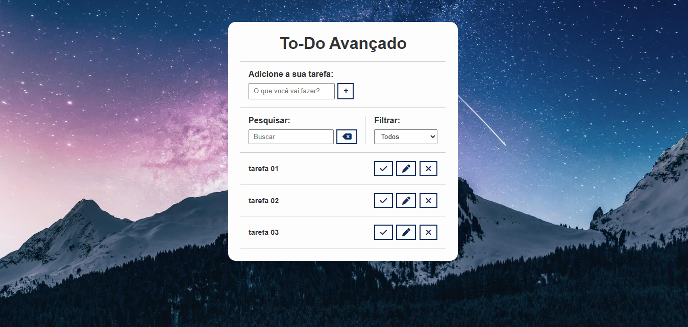

# Projeto: Todo list avançado

Neste projeto podemos verificar o campo de input de adição de novas tarefas.  
O campo input de pesquisa de tarefas é uma funcionalidade útil para a busca de uma tarefa pela inserção de uma palavra chave. 
No campo de filtro temos 3 opções de filtragem de tarefas:  
podemos filtrar todas as tarefas, filtrar as tarefas prontas e as tarefas a fazer.

No painel de exibição das tarefas temos as funcionalidades de completar e descompletar as tarefas, a funcionalidade de editar tarefa e a funcionalidade de excluir tarefa. 
Todos os dados seram salvos na local storage.

 

### TECNOLOGIAS:
HTML 
CSS 
JAVASCRIPT 
GIT/GITHUB 

